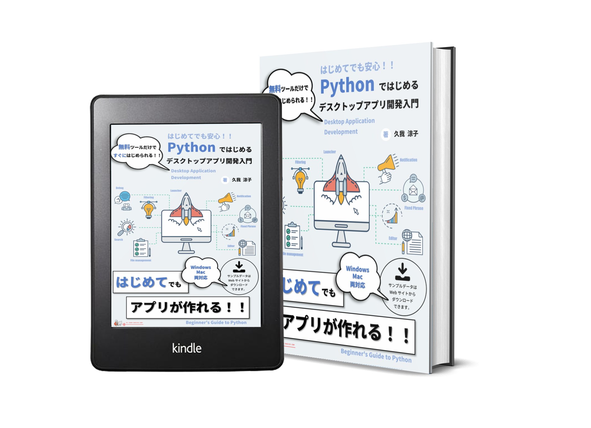

# 書籍「Pythonではじめるデスクトップアプリ開発入門」サポートページ

本リポジトリは、書籍「Pythonではじめるデスクトップアプリ開発入門」のサポートページです。  

## Amazon 製品ページ  
[紙書籍 (ペーパーバック)](https://www.amazon.co.jp/dp/B09K21NXDZ)  
[電子書籍 (Kindle)](https://www.amazon.co.jp/dp/B08YDT2TDY)  

電子書籍版は、[楽天](https://hb.afl.rakuten.co.jp/ichiba/1f8d2e89.397e6e74.1f8d2e8a.dd300d67/?pc=https%3A%2F%2Fitem.rakuten.co.jp%2Frakutenkobo-ebooks%2Fa6aa8433637732ca9a8c20415eb814f4%2F&link_type=hybrid_url&ut=eyJwYWdlIjoiaXRlbSIsInR5cGUiOiJoeWJyaWRfdXJsIiwic2l6ZSI6IjI0MHgyNDAiLCJuYW0iOjEsIm5hbXAiOiJyaWdodCIsImNvbSI6MSwiY29tcCI6ImRvd24iLCJwcmljZSI6MSwiYm9yIjoxLCJjb2wiOjEsImJidG4iOjEsInByb2QiOjAsImFtcCI6ZmFsc2V9)及び[BOOK☆WALKER](https://bookwalker.jp/de24bd8e89-7d2a-47e3-a053-e0b8e17cc74e/?acode=1DRCLqyC)でもご購入いただけます。  

## 書籍紹介

本書では、以下のような読者を対象として「Pythonを使用したデスクトップアプリケーションの開発方法」について解説しています。  

- プログラムを書いたことはないけど、アプリケーションを作ってみたい方  
-	プログラミングには興味があるけど、なかなか次の一歩を踏み出せないという方  
-	以前、プログラミングに挑戦してみたけど挫折してしまった方  
-	Pythonの基礎は学習したけど、次に何をすればよいか迷っている方  
-	学校や勉強会などでプログラミングの教材を検討している方  

本書は、プログラミングの知識がゼロからでも学習をはじめられます。最終的には、自身で小～中規模のデスクトップアプリケーションを開発できるようになることを目標にしています。本書を終えるころには、Pythonの公式ドキュメントや他の入門書を読む力も身につきます。  

以下のページから、目次までの試し読みができます。  
[試し読み (BOOK☆WALKER)](https://viewer-trial.bookwalker.jp/03/9/viewer.html?cid=24bd8e89-7d2a-47e3-a053-e0b8e17cc74e&cty=1)

## 出版情報

2021 年 10 月 25 日 第 2 版 発行  
2021 年 03 月 17 日 第 1 版（初版）発行  

## サンプルファイル

対応するChapter番号のフォルダにアクセスして、Jupyter Notebook用のノートブックを開いてください。詳しい使い方は、本書のまえがきをご参照ください。  

macOSで実行される場合は、[Chapter_3-1_mac.ipynb](https://github.com/RyokoKuga/python-app-book/blob/main/Chapter_3/Chapter_3-1_mac.ipynb
), [Chapter_4-1_mac.ipynb](https://github.com/RyokoKuga/python-app-book/blob/main/Chapter_4/Chapter_4-1_mac.ipynb), [Chapter_4-2_mac.ipynb](https://github.com/RyokoKuga/python-app-book/blob/main/Chapter_4/Chapter_4-2_mac.ipynb) をご利用ください。
それ以外のChapterに関するノートブックは、Windows環境と共通です。  

#### ※コードが実行できない場合や、ご不明な点などございましたら、ご遠慮無くお問い合わせください。  

## 補足情報

本書の補足情報は、本リポジトリの[SUPPLファイル](./SUPPL.md)をご参照ください。    
また、本書のよくある質問と回答は[FAQファイル](./FAQ.md)にまとめています。  

## 正誤情報

書籍の正誤表は、本リポジトリの[ERRATAファイル](./ERRATA.md)をご参照ください。  

## ライセンス

本リポジトリはMITライセンスです。[LICENSEファイル](./LICENSE)をご参照ください。  

## この本を共有

&emsp;
&emsp;
&emsp;
&emsp;  
